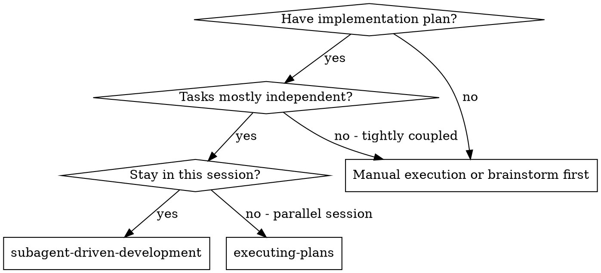
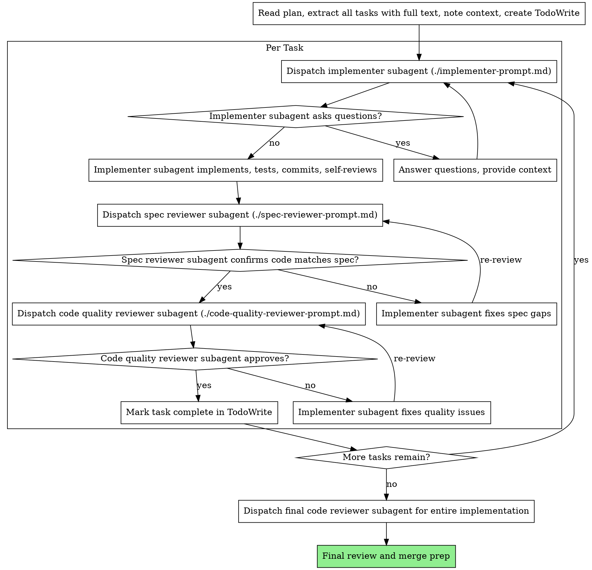

# Subagent-Driven Development

Execute plan by dispatching fresh subagent per task, with two-stage review after each: spec compliance review first, then code quality review.

**Core principle:** Fresh subagent per task + two-stage review (spec then quality) = high quality, fast iteration

## When to Use



**vs. Executing Plans (parallel session):**
- Same session (no context switch)
- Fresh subagent per task (no context pollution)
- Two-stage review after each task: spec compliance first, then code quality
- Faster iteration (no human-in-loop between tasks)

## The Process



## Prompt Templates

- `./implementer-prompt.md` - Dispatch implementer subagent
- `./spec-reviewer-prompt.md` - Dispatch spec compliance reviewer subagent
- `./code-quality-reviewer-prompt.md` - Dispatch code quality reviewer subagent

## Example Flow (abbreviated)

```
1. Read plan → extract all tasks → create TodoWrite
2. Per task:
   a. Dispatch implementer (answer questions if any)
   b. Implementer implements, tests, commits, self-reviews
   c. Dispatch spec reviewer → if issues, implementer fixes → re-review
   d. Dispatch code quality reviewer → if issues, implementer fixes → re-review
   e. Mark task complete
3. After all tasks: final code review → merge prep
```

## Why This Approach

- Fresh subagent per task = no context pollution
- Two-stage review (spec then quality) catches both missing requirements and bad code
- Questions surfaced before work begins, not after
- Same session = no handoff overhead
- Catches issues early (cheaper than debugging later)

## Red Flags

**Never:**
- Start implementation on main/master branch without explicit user consent
- Skip reviews (spec compliance OR code quality)
- Proceed with unfixed issues
- Dispatch multiple implementation subagents in parallel (conflicts)
- Make subagent read plan file (provide full text instead)
- Skip scene-setting context (subagent needs to understand where task fits)
- Ignore subagent questions (answer before letting them proceed)
- Accept "close enough" on spec compliance (spec reviewer found issues = not done)
- Skip review loops (reviewer found issues = implementer fixes = review again)
- Let implementer self-review replace actual review (both are needed)
- **Start code quality review before spec compliance is ✅** (wrong order)
- Move to next task while either review has open issues

**If subagent asks questions:**
- Answer clearly and completely
- Provide additional context if needed
- Don't rush them into implementation

**If reviewer finds issues:**
- Implementer (same subagent) fixes them
- Reviewer reviews again
- Repeat until approved
- Don't skip the re-review

**If subagent fails task:**
- Dispatch fix subagent with specific instructions
- Don't try to fix manually (context pollution)

## Integration

**Related skills:**
- **writing-plans** — Creates the plan this skill executes
- **code-review** — Code review dimensions used by reviewer subagents
- **executing-plans** — Alternative: parallel session execution with human-in-loop batches

**Subagent prompts (local to this skill):**
- `./implementer-prompt.md` — Implementation subagent
- `./spec-reviewer-prompt.md` — Spec compliance reviewer
- `./code-quality-reviewer-prompt.md` — Code quality reviewer
